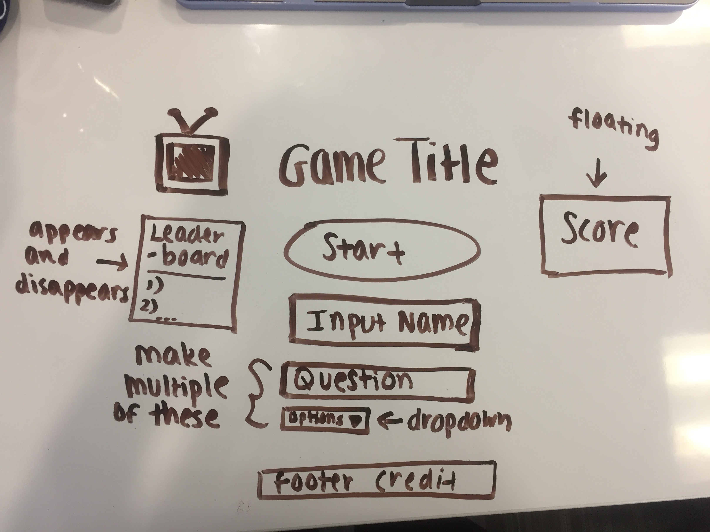

# "A Dose of Reality" Game Description

  The "A Dose of Reality" game is a game in which a user makes their Hollywood debut as a guest star of a popular reality TV show. Throughout the game, the user encounters a number of questions, which they must answer in order to make progress on their journey as a reality TV star. The decisions they make along the way influence the rest of their journey and the final outcome. When the user reaches the final outcome, they either win or lose points. Points are kept track of throughout all of the user's journeys, and points are allocated depending on whether the user's decisions contributed or detracted from success of their reality TV show.

  Multiple iterations of the game can be played. The user has the ability to guest star on a different reality show or opt to take a different path on the same reality show. In general, the objective of the game is to have fun trying to make it in Show Biz. Users will either keep playing the game to rack up more points if they're on a winning streak or they might try to redeem themselves if they have not been experiencing much luck. The game continues until the user decides on their own that they want to stop playing or a new user wants to play the game.

# How to Play the Game

1) Click the "Start Game" button.  
2) Type user name in input box and press 'ENTER'.  
3) Select level of drama preferred from the "options" dropdown menu.  
4) Answer the following questions in the same manner as the previous step.  
5) When the final outcome is reached, your current score will be updated (it will be displayed in a floating box to the right).  
6) You may either choose to embark on another journey and repeat the process from Step 3 or you may stop and allow a new user to play the game.

# Tests Conducted

* Unit tests conducted by Developer
* Asked new users to provide feedback on bugs they encountered as well any suggestions they had regarding UI and game functionality
* Used Google Chrome's Audit feature to analyze my webpage

# Stack

* HTML
* Javascript
* CSS

# Acknowledgments

* Google
* Stack Overflow
* Peers and Instructors

# Wireframe

**Did not have a chance to implement the leaderboard*
